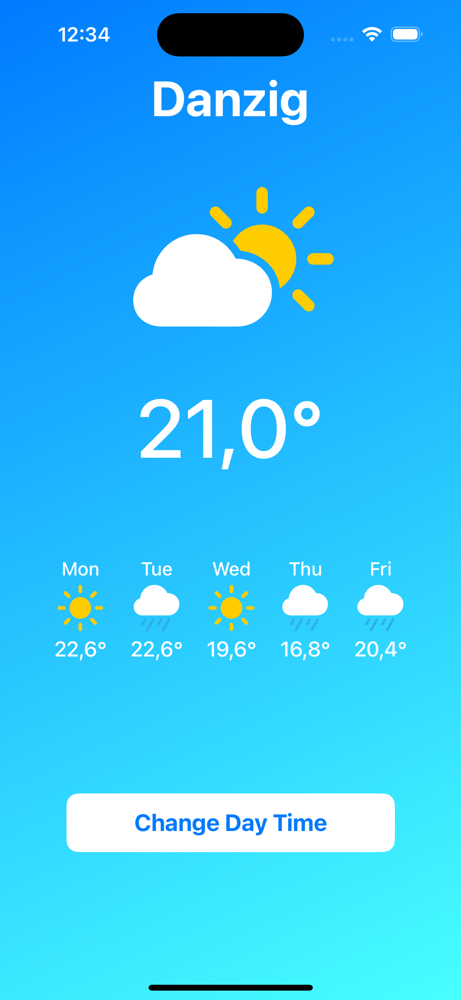
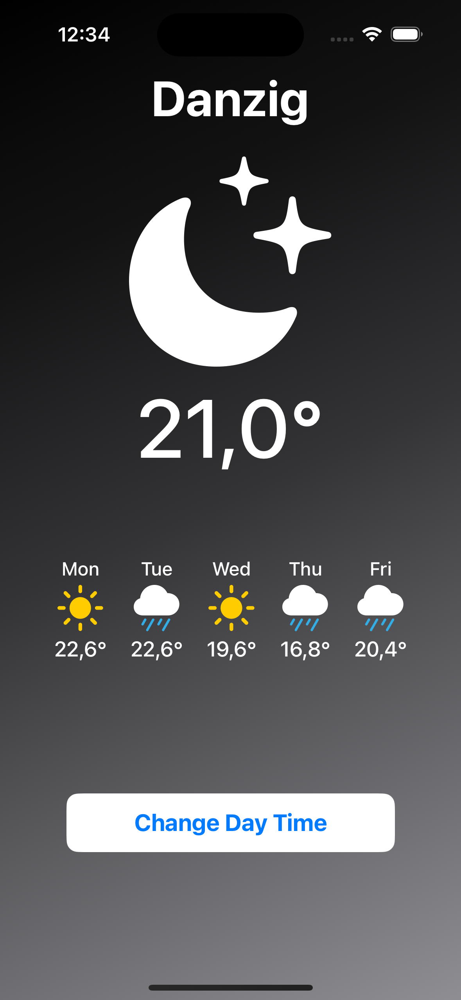

# iOS WeatherApp

|  |  |
|-----------------------------|---------------------------------|

## Description

First attempt to learn Swift and iOS development.

## Details

This project is a simple iOS application written in Swift and SwiftUI.
It should fetch weather info from https://open-meteo.com and present current weather and forecast for next 5 days.
